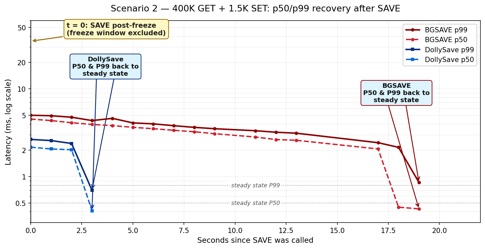
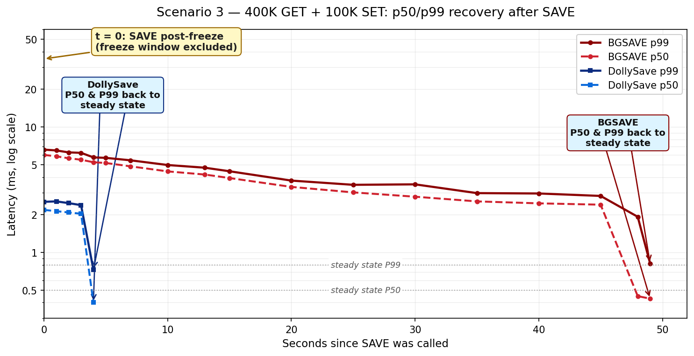

# A new way to SAVE: DollySave — up to 35× faster, no COW memory blow-up, OOM-safe

## TL;DR

`BGSAVE` has served Valkey well, but on modern multi-hundred-GB
instances it has three painful failure modes: it takes a long time,
its memory overhead grows with the write rate (copy-on-write), and
in the worst case it runs the host out of memory.

We prototyped **DollySave**, a drop-in alternative SAVE path. On a
300 GB dataset it is **up to 35× faster**, uses a **constant, tiny
amount of extra memory** regardless of write pressure (instead of
scaling with the write rate the way `BGSAVE` does), shortens the
process freeze by **up to ~6.6 s**, recovers p50/p99 in **~3–4 s
instead of ~19–49 s**, and — most importantly — **never OOMs**,
even under heavy write traffic that kills `BGSAVE` today.

The Valkey-side change required to support this is tiny: **one new
admin command, ~240 LoC, no changes to the existing `BGSAVE` path**.
PR link: **#TODO**.

The rest of this issue walks through the benchmarks scenario by
scenario, building up from a quiet server to a write-heavy one, so you
can see exactly where `BGSAVE` falls over and where DollySave holds up.

---

## Setup

- **Instance:** `r7g.16xlarge` (Graviton3, 64 vCPU, 512 GB RAM)
- **Dataset:** 4,500,000 keys × 512 bytes ≈ **300 GB**
- **Measured:** wall-clock SAVE duration, extra RSS during SAVE,
  process freeze time, and p50/p99 latency recovery after SAVE is
  called (measured from the moment SAVE starts)

---

## Scenario 1 — idle server: how much does SAVE cost when *nothing* is happening?

Before we pile on traffic, let's ask the simplest question: if the
server is doing **nothing at all**, how expensive is it just to take
a snapshot?

|                          | BGSAVE        | DollySave |
| ------------------------ | ------------- | --------- |
| Duration                 | **1102.31 s** | **31.24 s** (**35.3× faster**) |
| Extra memory during SAVE | 2.28 GB       | 37 MB     |
| Process freeze time      | 4207 ms       | 233 ms (−3974 ms) |

On an idle 300 GB server, `BGSAVE` takes over **18 minutes**. DollySave
finishes in **31 seconds**. The process-freeze interval — the window
during which Valkey cannot serve *any* command — drops from 4.2 s to
233 ms.

No traffic, no writes, no contention. This is the *best case* for
`BGSAVE` — and it's still 35× slower than DollySave.

---

## Scenario 2 — add 400K read TPS: what happens under realistic reads?

Now let's put the server under a realistic read load. We keep writes
light (1.5K SET/s) and push reads up to a steady **400,000 GET/s**.

|                          | BGSAVE     | DollySave |
| ------------------------ | ---------- | --------- |
| Duration                 | **1084 s** | **32 s** (**33.9× faster**) |
| Extra memory during SAVE | 24.0 GB    | 97 MB     |
| Process freeze time      | 4173 ms    | 1216 ms (−2957 ms) |

Duration is essentially unchanged from Scenario 1 — even though
we've added a large read load, only the 1,500 SET/s actually dirty
pages, so `BGSAVE`'s COW cost stays relatively manageable.

Look at the extra-memory row, though: **`BGSAVE` has already
jumped from 2.28 GB (Scenario 1) to 24 GB, and we haven't even
turned writes up yet.** DollySave went from 37 MB to 97 MB.

The more interesting result here is **how long it takes p50 / p99
to recover** after SAVE is called.

### Latency recovery after SAVE is called

Both SAVE paths cause a latency disturbance — we care about how
long each one takes to come back to baseline.

- **`BGSAVE`** forks the process, and every subsequent write from
  the parent forces the kernel to copy a page out of shared
  memory. That copy-on-write traffic stays elevated throughout the
  SAVE, and the allocator / page tables take a while to settle
  afterward — so the recovery tail is long.

- **DollySave** asks the kernel to write-protect memory so it can
  track which pages get dirtied. When the application writes to a
  tracked page, **the kernel just marks the page as dirty — no
  copies, no userspace fault handler**. The dirty bits are read
  back in bulk and used to decide which pages still need to be
  shipped. The only latency overhead the application sees is a
  brief, contained bump at the *start* of SAVE — then it's done.

So both series below start at **`t = 0` = the moment SAVE is
called**, and we measure **how long p50 and p99 take to recover to
baseline**.

Note: samples taken during the process-freeze window are excluded
from these traces — that cost is already reported separately in the
"Process freeze time" row of the table above. What we're measuring
here is the *post-freeze* recovery tail.

*Four series on a shared x-axis (seconds since SAVE was called).
DollySave (blue) drops back to baseline after ~3 s; BGSAVE (red)
takes ~19 s. Y-axis is log-scaled. Raw numbers below for
verification against the benchmark report.*

| Seconds since SAVE | BGSAVE p50 (ms) | BGSAVE p99 (ms) | DollySave p50 (ms) | DollySave p99 (ms) |
| -----------------: | --------------: | --------------: | -----------------: | -----------------: |
| 0                  |         4.53    |         5.01    |              2.17  |              2.66  |
| 1                  |         4.36    |         4.95    |              2.07  |              2.58  |
| 2                  |         4.12    |         4.76    |              2.03  |              2.39  |
| 3                  |         3.94    |         4.36    |        **0.41** ✓  |        **0.70** ✓  |
| 4                  |         3.82    |         4.62    |              0.41  |              0.61  |
| 5                  |         3.65    |         4.10    |              0.40  |              0.79  |
| 6                  |         3.52    |         4.00    |              0.45  |              1.06  |
| 7                  |         3.38    |         3.81    |              0.41  |              0.81  |
| 8                  |         3.25    |         3.65    |              0.42  |              0.89  |
| 9                  |         3.09    |         3.52    |              0.41  |              0.91  |
| 11                 |         2.83    |         3.34    |              0.42  |              0.87  |
| 12                 |         2.65    |         3.21    |              0.41  |              0.79  |
| 13                 |         2.60    |         3.13    |              0.42  |              0.81  |
| 17                 |         2.07    |         2.44    |              0.41  |              0.65  |
| 18                 |   **0.45** ✓    |         2.16    |              0.46  |              0.86  |
| 19                 |         0.43    |   **0.86** ✓    |              0.41  |              0.84  |

✓ = back to baseline.

Headlines from the data (with `t = 0` = SAVE called,
process-freeze samples excluded):

- **BGSAVE p99** enters the post-freeze window at ~5 ms and takes
  **~19 s** to return to baseline.
- **BGSAVE p50** peaks at 4.53 ms, **~18 s** to return.
- **DollySave p99** peaks at **2.66 ms**, back to baseline in
  **~3 s**.
- **DollySave p50** peaks at 2.17 ms, same **~3 s** recovery.

For any service with an SLO on p99, the recovery window matters as
much as the SAVE duration itself. A ~19-second window during which
p99 stays elevated is a real, user-visible event — on top of the
multi-second freeze already reported in the table above.

---

## Scenario 3 — add 100K write TPS: the "why we're really doing this" scenario

Now we add the workload that breaks `BGSAVE`: **400K GET/s + 100K
SET/s** on the same 300 GB dataset.

This is the scenario where `BGSAVE`'s fundamental design — `fork()`
and let the kernel copy-on-write — stops being a tradeoff and starts
being a liability.

Remember the setup: we're on a **512 GB machine using only 300 GB
for Valkey data**, which leaves ~200 GB of headroom. Under this
workload, `BGSAVE`'s COW cost alone **consumed that entire ~200 GB
of headroom** before the snapshot could finish — at which point the
host ran out of memory.

|                          | BGSAVE                   | DollySave |
| ------------------------ | ------------------------ | --------- |
| Duration                 | 527 s **then OOM crash** | 32.99 s   |
| Extra memory during SAVE | **~200 GB — host OOM**   | 144 MB    |
| Process freeze time      | 8346 ms                  | 1736 ms (−6610 ms) |

DollySave used **144 MB** here — in the same ballpark as its
idle-server number (37 MB) and its read-heavy number (97 MB). The
extra-memory cost **does not scale with the write rate**. It
completed the snapshot in 33 seconds and never came close to OOM.

### Latency recovery after SAVE is called (same story, bigger gap)

Same four-series picture as Scenario 2 — both series start at
**`t = 0` = the moment SAVE is called**, process-freeze samples
excluded, and we measure **how long p50 and p99 take to recover to
baseline**. The BGSAVE curve shown here is from the **restart after
its OOM crash** (under this workload BGSAVE cannot complete, so
there is no recovery tail to measure from the original run).

*Same four series as Scenario 2, under heavier write load.
DollySave (blue) drops back to baseline after ~4 s; BGSAVE (red)
takes ~49 s. Y-axis is log-scaled. Raw numbers below.*

| Seconds since SAVE | BGSAVE p50 (ms) | BGSAVE p99 (ms) | DollySave p50 (ms) | DollySave p99 (ms) |
| -----------------: | --------------: | --------------: | -----------------: | -----------------: |
| 0                  |         6.01    |         6.62    |              2.19  |              2.54  |
| 1                  |         5.85    |         6.52    |              2.14  |         **2.56**   |
| 2                  |         5.65    |         6.29    |              2.09  |              2.48  |
| 3                  |         5.50    |         6.24    |              2.04  |              2.39  |
| 4                  |         5.25    |         5.74    |        **0.40** ✓  |        **0.73** ✓  |
| 5                  |         5.18    |         5.69    |              0.42  |              0.74  |
| 7                  |         4.87    |         5.44    |              0.41  |              0.63  |
| 10                 |         4.44    |         4.99    |              0.40  |              0.58  |
| 13                 |         4.19    |         4.75    |              0.41  |              0.67  |
| 15                 |         3.93    |         4.45    |                 —  |                 —  |
| 20                 |         3.34    |         3.75    |                 —  |                 —  |
| 25                 |         3.02    |         3.47    |                 —  |                 —  |
| 30                 |         2.79    |         3.50    |                 —  |                 —  |
| 35                 |         2.56    |         2.98    |                 —  |                 —  |
| 40                 |         2.47    |         2.96    |                 —  |                 —  |
| 45                 |         2.41    |         2.83    |                 —  |                 —  |
| 48                 |   **0.45** ✓    |         1.93    |                 —  |                 —  |
| 49                 |         0.43    |   **0.82** ✓    |                 —  |                 —  |

✓ = back to baseline.

Recovery time (with `t = 0` = SAVE called, process-freeze samples
excluded):

- **BGSAVE p99** enters the post-freeze window at ~6.6 ms and takes
  **~49 s** to return to baseline.
- **BGSAVE p50** takes **~48 s** to recover.
- **DollySave p99** is back to baseline in **~4 s**.
- **DollySave p50** is back to baseline in **~4 s**.

Under real write pressure, this is the difference between a recovery
tail that lives inside your error budget and one that blows through
it — or, in the worst case, takes the host down with it.

---

## Scenario 4 — single thread, small box: is DollySave just "parallel"?

A fair skeptic at this point says: *"You're beating `BGSAVE` because
you've thrown more threads at it. Hold parallelism constant and the
advantage disappears."*

So we ran Scenario 4 on a smaller `r7g.xlarge` with a **single
sender thread** and 220 million small keys (50 B each) — same 300 GB
total, different shape.

|                          | BGSAVE     | DollySave |
| ------------------------ | ---------- | --------- |
| Duration                 | 149.68 s   | 23.16 s (**6.46× faster**) |
| Extra memory during SAVE | 149 MB     | 9 MB      |
| Process freeze time      | 329 ms     | 85 ms (−244 ms) |

Even **single-threaded**, with none of the parallel-sender machinery
engaged, DollySave is **6.5× faster** than `BGSAVE`. The advantage
isn't coming from threads — it's coming from *not* relying on
`fork()` + COW.

---

## Summary across all four scenarios

| Scenario                   | Duration (BGSAVE → Dolly)     | Extra RSS (BGSAVE → Dolly) | Freeze (BGSAVE → Dolly) |
| -------------------------- | ----------------------------- | -------------------------- | ----------------------- |
| 1. Idle                    | 1102 s → 31 s  (**35×**)      | 2.28 GB → 37 MB            | 4207 ms → 233 ms        |
| 2. 400K GET + 1.5K SET     | 1084 s → 32 s  (**34×**)      | 24.0 GB → 97 MB            | 4173 ms → 1216 ms       |
| 3. 400K GET + 100K SET     | 527 s + **OOM** → 33 s        | **~200 GB + OOM** → 144 MB | 8346 ms → 1736 ms       |
| 4. Single-thread (300 GB)  | 150 s → 23 s   (**6.5×**)     | 149 MB → 9 MB              | 329 ms → 85 ms          |

Two patterns jump out of that table:

- **DollySave duration stays in the 23–33 s range** across every
  scenario. `BGSAVE` ranges from 527 s (when it crashes) to 1102 s.
- **DollySave extra-RSS stays in the 9–144 MB range**, independent
  of workload. `BGSAVE` goes from 2.28 GB → 24 GB → OOM as write
  pressure climbs.

---

## What this costs Valkey to support

Almost nothing. **One new admin command** — `CLEAN_STATE_FOR_DOLLY_SAVE`
— **~240 LoC**, run once on the restored target to clear source-host
identity (runid, cluster node-id, peers, epochs) while preserving
replication state so the target can `PSYNC` partial-resync against
its new primary. The `BGSAVE`/`fork()` path is **completely
untouched**.

Full PR (draft): **#TODO**

> **Scope disclaimer.** DollySave has only been tested in a
> **standalone** Valkey deployment so far — the focus of the work
> to date has been on the CRIU-side dump/restore logic, not on
> Valkey-side cluster behaviour. The PR linked above is a **draft**
> intended to scope the Valkey-side change and start the
> conversation; once the community aligns on direction, we'll
> expand testing to cover the cluster scenarios (failover, slot
> migration, multi-shard PSYNC, etc.) and add corresponding tests.

---

## How it works

DollySave does **not** `fork()` the process. Instead, it treats a
snapshot as a **live process migration**: the process keeps running
and serving traffic while its memory is streamed out; only a brief
final pass runs while the process is frozen.

Three moves, at a high level:

1. **Track writes without copying.** Ask the kernel to write-protect
   the process's memory (via `UFFD_FEATURE_WP_ASYNC`) so we can
   later ask which pages got dirtied. When the process writes to a
   tracked page, the kernel just marks it as dirty — no copies, no
   userspace fault handler, no COW page duplication. Dirty bits are
   read back in bulk via `PAGEMAP_SCAN`.
2. **Stream memory while the process runs.** Parallel workers copy
   memory out, compressed. Pages that get re-dirtied are simply
   re-sent and overwrite the older copy on the receiving side. The
   process keeps serving reads and writes the whole time. 
3. **Brief final freeze.** Once the dirty set has converged, freeze
   the process just long enough to capture the last-moment dirty
   pages and process-tree metadata, then unfreeze. This is the only
   part of SAVE during which Valkey cannot serve commands — and
   it's measured in hundreds of milliseconds to ~1.7 s in our tests,
   instead of the multi-second freezes `BGSAVE` produces.

> **A second, freeze-free variant exists.** We also implemented a
> *synchronous* WP mode (`UFFD_FEATURE_WP`, not `WP_ASYNC`) in which
> the kernel delivers a userfaultfd event on every write and the
> dump path ships each page as it is written. That variant has **no
> final freeze at all** — but the per-write userspace round-trip
> imposes a real p50/p99 tax on the application. We chose the
> async/final-freeze design for the results shown above because it
> gives better application latency during SAVE. The sync variant is
> still in the tree and may be a better fit for workloads that
> cannot tolerate *any* freeze, at the cost of elevated tail
> latency throughout SAVE.

The heavy lifting (write-protect tracking, parallel transfer, restore
coordination) lives in an **experimental fork of CRIU**
(Checkpoint/Restore in Userspace). From Valkey's perspective, the
entire dump mechanism is external — which is why the Valkey-side
change is just the one admin command above.

Full design docs:

- **High-level design:** TODO (link to `COW_DUMP_HIGH_LEVEL_DESIGN.html`)
- **Detailed design:**   TODO (link to `COW_DUMP_DESIGN.html`)

---

## Questions for the community

1. Would an alternative SAVE path with these properties be valuable to
   upstream?
2. Is the proposed command shape (admin-only, preserves replication
   state, LOADING/STALE-safe) the right API surface?
3. Any corner cases you'd like to see covered before review?

Happy to share the full benchmark harness and raw traces in
follow-up comments if there's interest.
